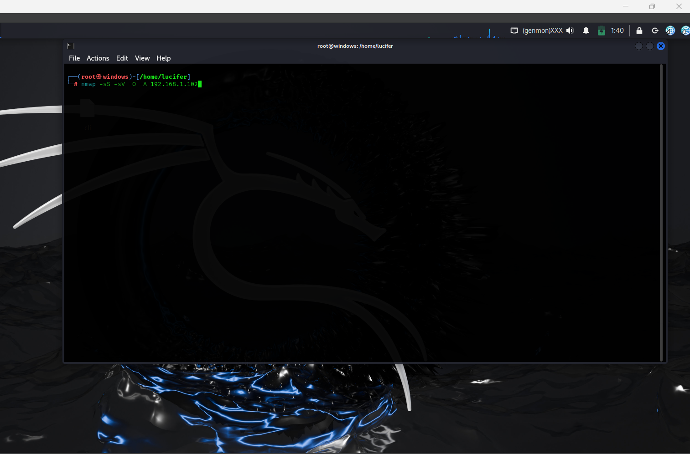

# 🛡️ Network Security Assessment Report

**Author:** Sachin Singh  
**Date:** October 2025  
**Assessment Type:** Network Security Evaluation  
**Tools Used:** Nmap, Wireshark  
**Deliverables:**  
- `network_security_assessment.md` (this report)  
- `nmap_results.txt` (scan results)  
- `wireshark_capture.pcap` (packet capture file)  

---

## 🎯 Objective

The objective of this assessment is to perform a **comprehensive security analysis** of a test network using **Nmap** and **Wireshark**.  
The focus is to:
1. Identify open ports and active services.
2. Detect potential vulnerabilities or misconfigurations.
3. Observe and analyze network traffic to identify insecure communications or suspicious behavior.
4. Provide actionable recommendations to improve the overall security posture of the network.

---

## ⚙️ Tools and Environment

| Tool | Purpose | Version | Platform |
|------|----------|----------|-----------|
| **Nmap** | Network scanning and service discovery | 7.94 | Kali Linux |
| **Wireshark** | Packet capture and traffic analysis | 4.x | Kali Linux |

**Test Network:** Local Virtual Network (DVWA, Metasploitable2, or internal lab setup)  
**Target System:** 192.168.1.102

---

## 🔍 Step 1 – Network Scanning with Nmap

### **Command Executed**
```bash
nmap -sS -sV -O -A 192.168.1.102
